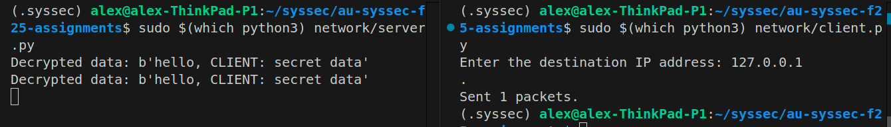

### Task 1: Encrypted covert channel
I chose to do Task 1 for this assignment 

Screenshot:

###
Instructions to run the code on debian based systems-

## Files explained:
All (solution) code resides in :
/home/alex/syssec/au-syssec-f25-assignments/network

At that level:
server.py - has server code
client.py - has client code
aes_crypto.py - has enc/dec functions
use_crypto.py - (can be ignored) sanity checks that crypo is working right

## How to run the code:
1. download solution code

2. cd into the folder
`cd au-syssec-f25-assignments`
(please make sure to stay at this level while running the rest if the steps)

3. make a venv(dealers choice- however you manage virtual envs)

4. activate it(however you manage your virtual envs)

5. Install dependencies
`pip3 install scapy`
`pip3 install pycryptodome`

6. Run server.
Note: scapy needs elevated priveledges to send and sniff packages. You can read throuh the code to make sure nothing harmful going on. 
`sudo $(which python3) network/server.py`

7. Run Client
Note: same as previous. Elevated privledge needed to send packets
`sudo $(which python3) network/client.py`

# Troubleshooting notes:

1. I tested this on my local machine using loopback IP, and hence the loopback interface. My loopback interface is called "lo", and this can be named differently on differnt devices. server.py line 33 specifies that as the interface to listen on.

`sniff(filter="icmp ", prn=icmp_callback, store=0, iface="lo") 
`

If the code does not work for some reason, try checking your specific loopback interface name

`ifconfig` on ubuntu, will show interfaces.

`sniff(filter="icmp ", prn=icmp_callback, store=0, iface="<your_interface_name>") `

2. If you test on 2 different devices, please change the interface name accordingly in the last line in server.py

# Citations and references:
1. https://thepacketgeek.com/scapy/ for a really well explained beginner friendly introduction to scapy. I was a bit lost before that

2. https://scapy.net/  < 3 < 3

3. ChatGPT for tasks i did not want to look up python docs for(and also scapy docs for, but honesty scapy is just so intuitive < 3), also writing enc/dec code. 